

  
### <a href="README.md">Home</a> &nbsp; | &nbsp; <a href="portfolio-bhirabhat.md">Pae's Port</a> &nbsp; | &nbsp; <a href="portfolio-songpol.md">Leng's Port</a> &nbsp; | &nbsp; <a href="portfolio-theeranon.md">Pond's Port</a> &nbsp; | &nbsp; <a href="portfolio-warakorn.md">Big's Port</a> &nbsp; | &nbsp; <a href="portfolio-warawich.md">Nook's Port</a>

 

<h1 align="center">Bhirabhat Klomjit (Pae)</h1>
<h3 align="center">Tech Lead & AI Engineering</h3>

FIBO, KMUTT · 2nd Year

  
  
  

---

### About

Undergraduate Robotics & Automation Engineering student at **KMUTT's Institute of Field Robotics (FIBO)**, working part-time as a robotics software engineer alongside coursework. Full-stack across the whole robot: LiDAR/point-cloud pipelines and backend services on one end, ROS 2 middleware and control logic in the middle, STM32 firmware and electrical control boxes on the other.

| | |
|---|---|
| **Degree** | B.Eng. Robotics & Automation · FIBO, KMUTT |
| **Year** | 2nd Year |
| **Hackathon** | JUMP Thailand 2026 Participant |
| **Focus** | Robotics System Integration, Web Interfaces, Embedded Firmware, ROS 2 |
| **Teaching** | Robotics, Python, and VEX IQ Mentor |
| **Seeking** | Robotics Engineering Opportunities |

---

### Highlight Projects & Technical Experience

**Professional work (FIBO, part-time)**

**Database & Backend — Flagship**
> **Yokogawa — Real-Time LiDAR Stockpile Monitoring:** Built the DB/backend platform for a warehouse system tracking bulk-material pile volume from 8× Livox Mid-360 LiDARs. The work order called for a Supabase pile-data platform with FIFO pile grouping; implementing it surfaced that Supabase's auto-generated API (PostgREST) couldn't run the needed business logic (fill-% from height-map sums, in-DB state transitions). Rebuilt it as a dedicated FastAPI service (`pile_monitor`) driving a **priority-ordered pile-slot state machine** (filling_up → prioritized → disappearing → cleared, slots queued by distance-to-furnace) — a more robust replacement for the originally-specified FIFO grouping. Also designed the 6-table schema, the IoU+centroid identity-tracking algorithm that keeps a pile's identity across scans as it's partially removed, and an ISO 17757-aligned logging pipeline (Loki + InfluxDB + Grafana). Ran April through July.

**Robot Interface (Facobot AMR)**
> **Facobot Control System:** Designed the operator interface for a warehouse AMR forklift — a React 19 app talking to a custom Python ROS 2 bridge node, with velocity jogging, Nav2 waypoint missions, and fleet management synced live to Supabase. Built a software safety layer (locked "Safe State," WebSocket watchdog, dead-man's-switch braking). A later DevOps audit cut the Docker image from 600+ MB to 94 MB and idle RAM from ~300 MB to 15 MB.
>    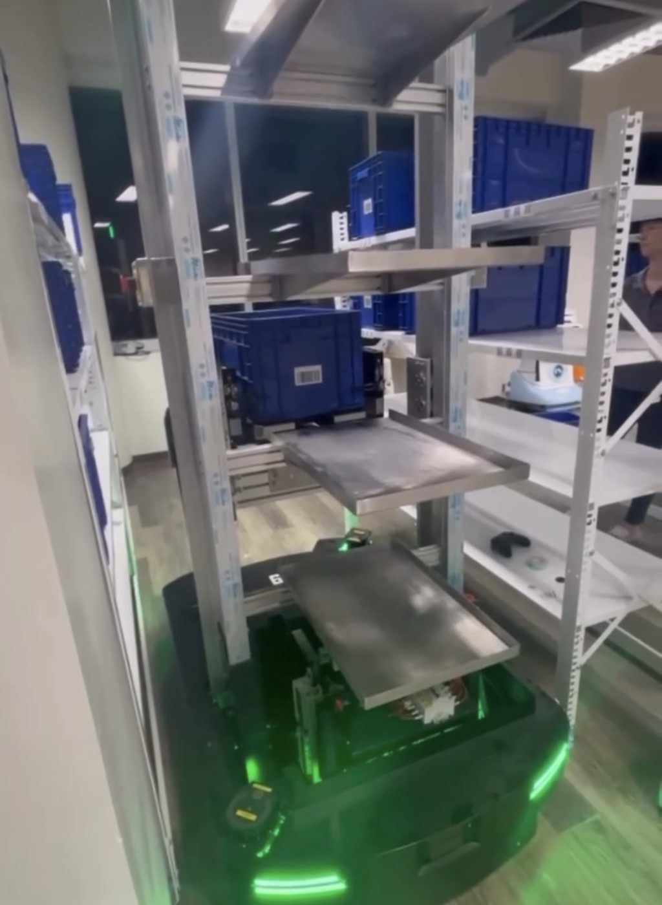 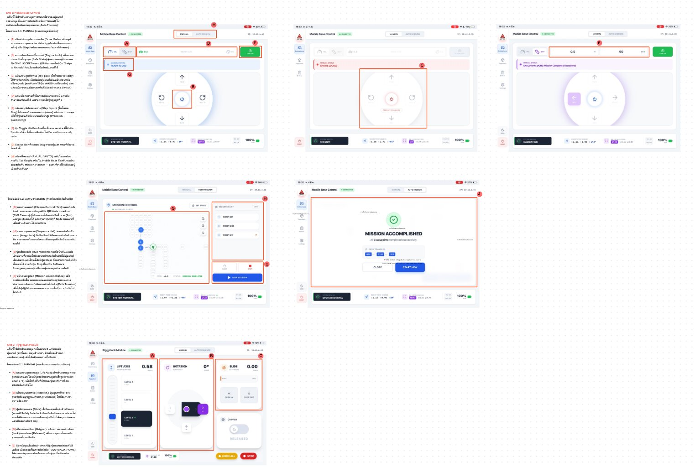

**Robotics Visualization**
> **B2 Web RViz (PTTEP):** Built a browser-based replacement for desktop RViz to teleoperate a Unitree B2 quadruped from an iPad, no local ROS 2 install needed. React Three Fiber renders live LiDAR point clouds and an accumulating occupancy map entirely outside React's render cycle, plus MJPEG camera streaming and Nav2 waypoint following.
>    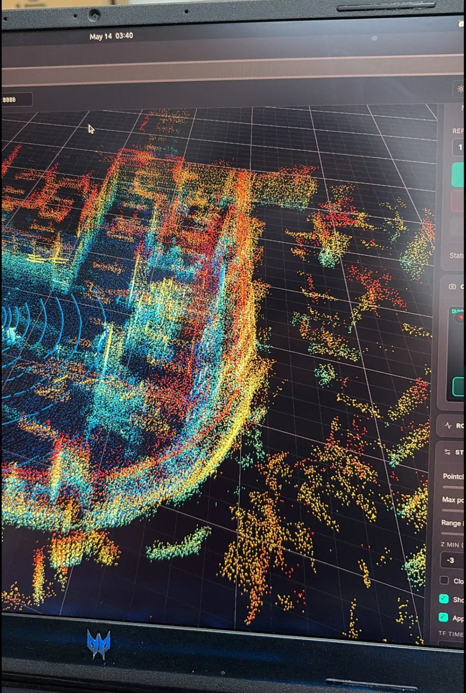

**Navigation Math**
> **Peplink GPS–Odometry Alignment:** Built a ROS 2 node aligning outdoor GPS with robot odometry — HDOP-weighted covariance estimation, a weighted SVD solver between GPS and odometry frames, and covariance rotation so RViz error ellipses reflect the true motion axes.

**Coursework & competition**

**Embedded Systems & Control**
> **1-DOF Pick-and-Place Arm:** Designed and built a control box utilizing STM32 (NUCLEO-G474RE). Developed safety circuits, calculated motor stall currents, selected relays, and integrated a 24V DC NPN proximity sensor (PR08-1.5DN) for precise operation.
>    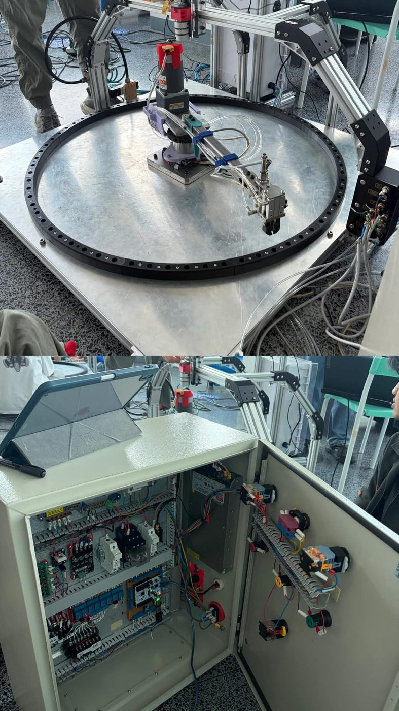 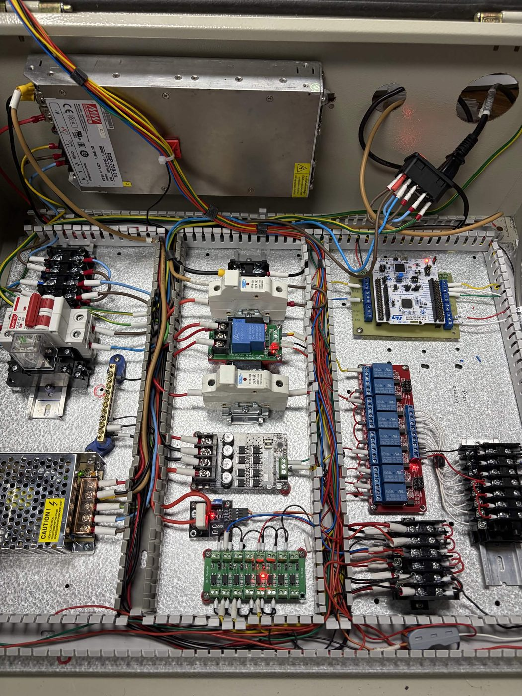

**Mechanical Design & Fluid Simulation**
> **Grease Separator (Oil Skimmer):** Developed the control system on a Raspberry Pi Pico — alternating timer logic to skim oil continuously, live pH sensing, automated LCD/light indicators. Used SolidWorks for 3D part design and flow simulation.
>    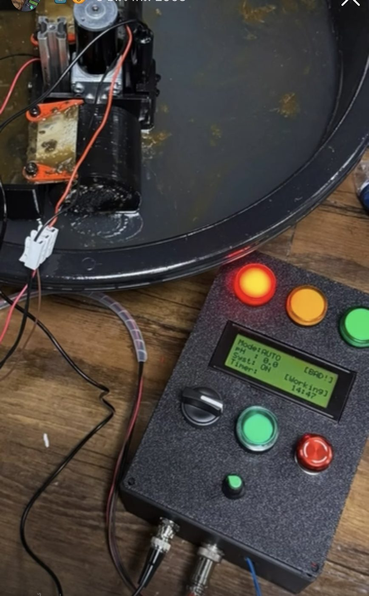 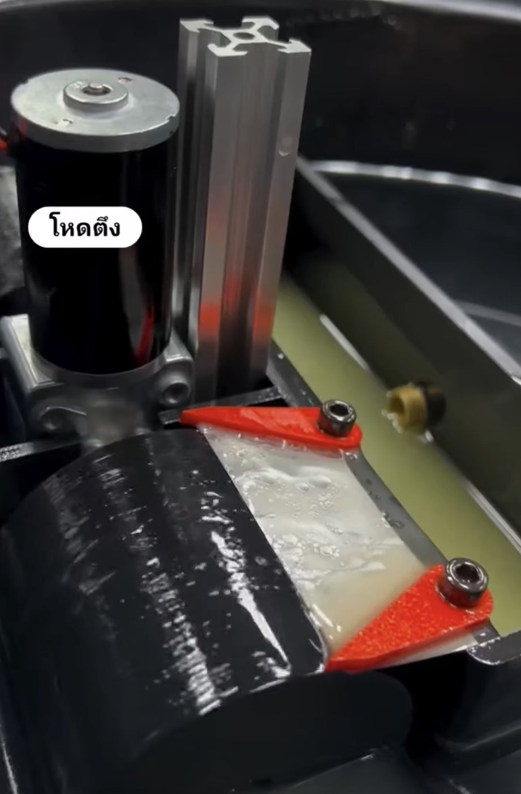

**Pure Analog & Digital Logic**
> **FRA161 Squash Ball Hitting Machine:** Designed the complete logic control board using pure electronic components (555 timers, relays) — no microcontroller. Built a custom PSU, custom PCBs, and a joystick interface for manual operation.
>    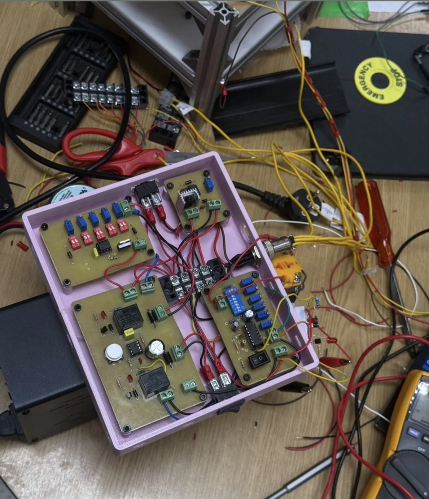 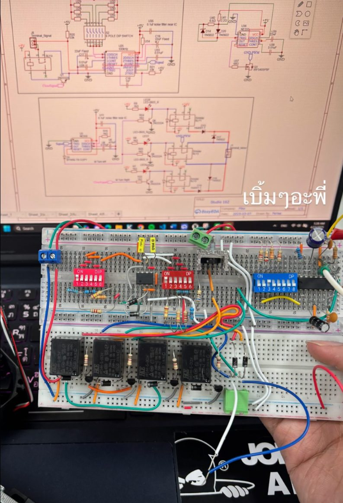 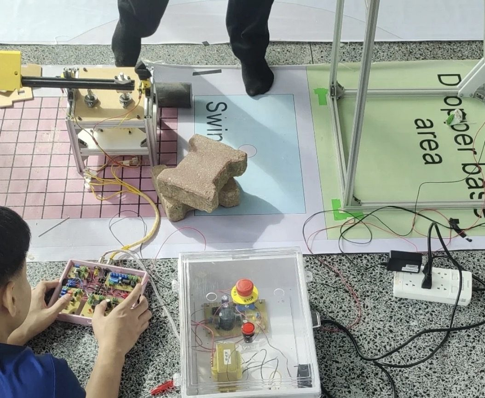

**Automation & Conveyor Systems**
> **LiftEase (Patient Transfer Bed):** Designed the mechanical structure and electrical control system for a bed-to-bed patient transfer system. Firmware on Raspberry Pi Pico for conveyor/motor control and Arduino for the directional button interface.
>    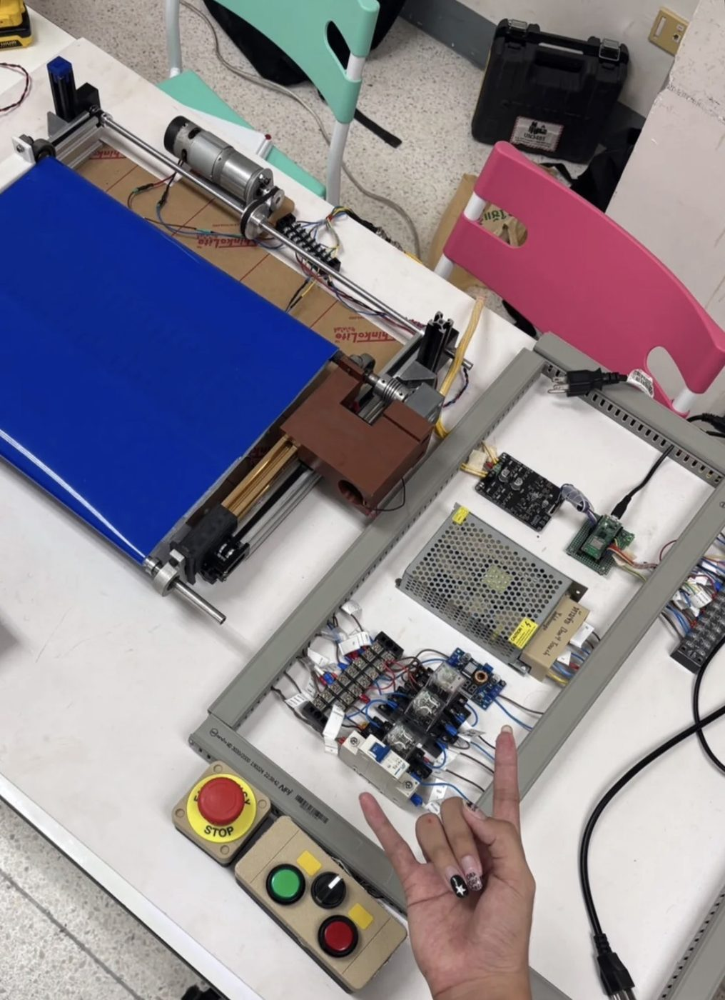

**Robotics Competition**
> **ABU Robocon (Meihua):** Developed the mobile-base software for the competition robot — low-level communication and movement logic using ROS 2 and micro-ROS.
>    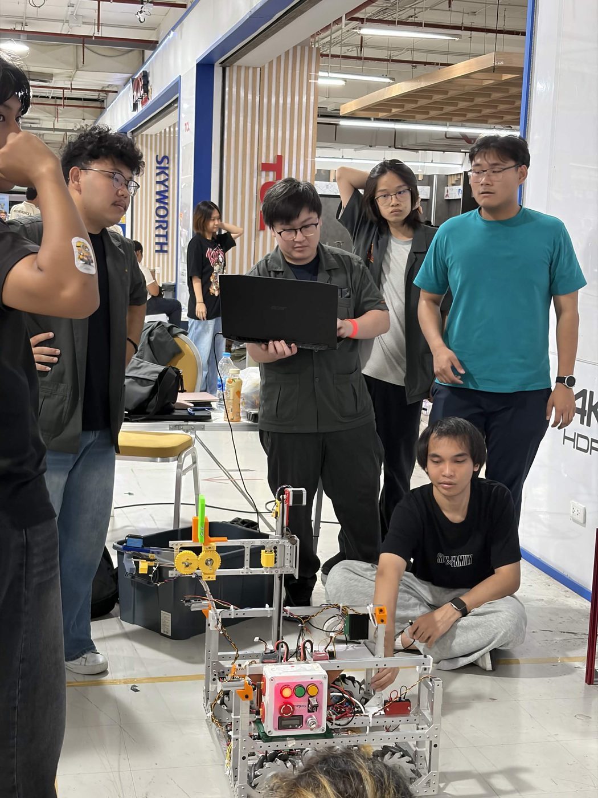

---

### Core Skills

**Robotics & Intelligence**

`micro-ROS` `Point Cloud Processing` `SLAM & Nav2`

**Backend & Data**

`FastAPI` `PostgreSQL / Supabase` `MQTT` `Grafana / Loki / InfluxDB`

**Web & Visualization**

`React Three Fiber` `Zustand` `WebSocket`

**Hardware & Firmware**

`Pure Logic Circuit` `Electrical Wiring`

**CAD & Simulation**

---

### GitHub Activity

  
  

