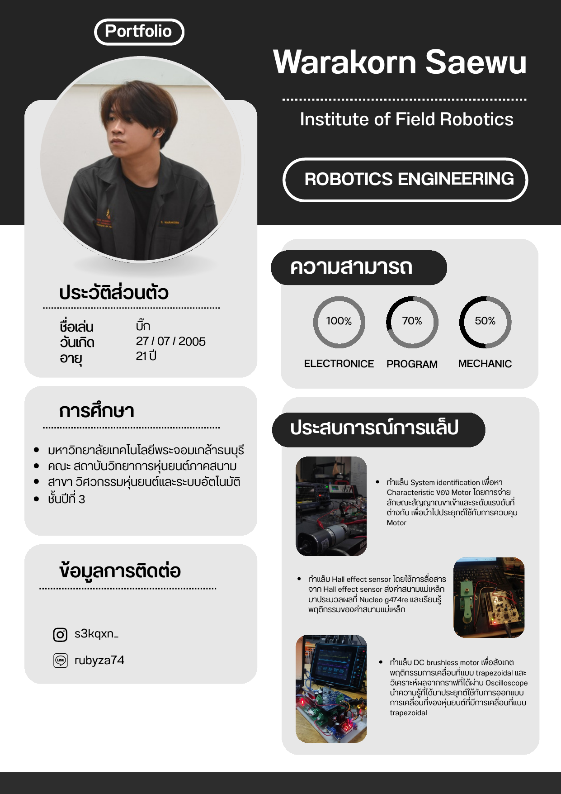
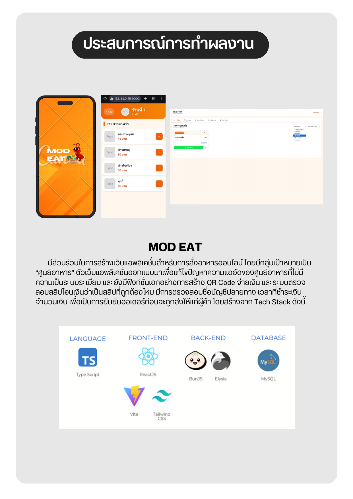
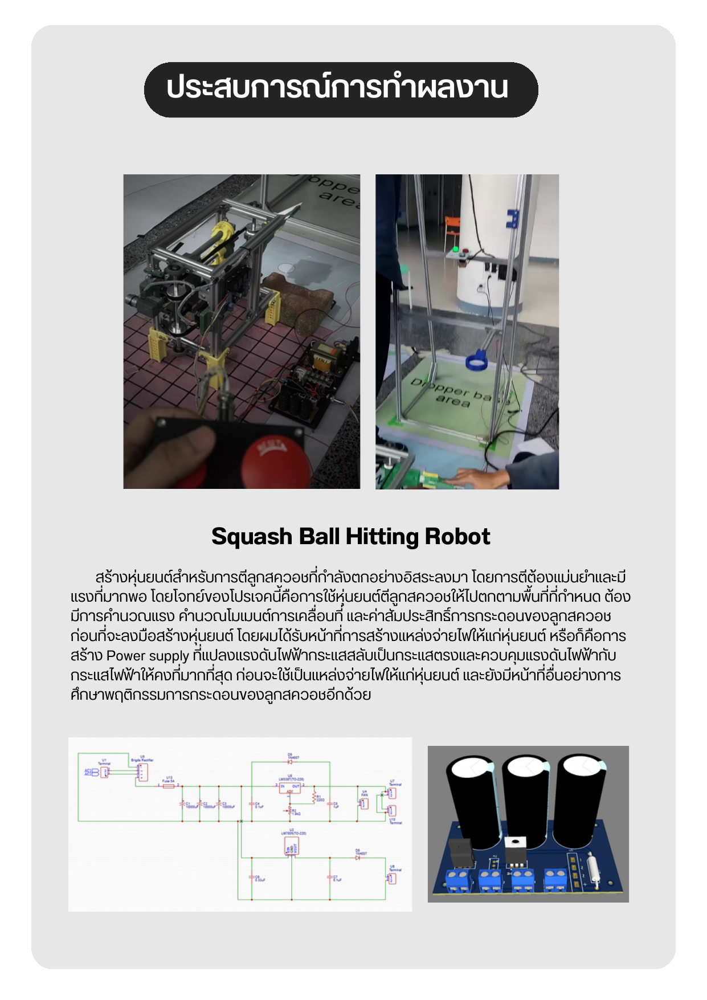
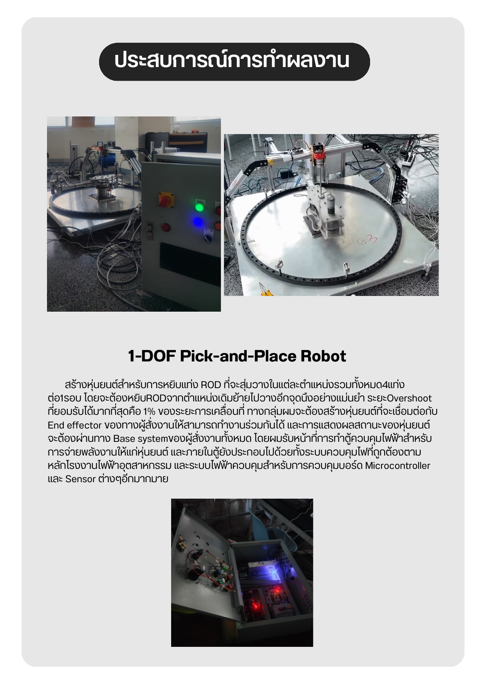

<a href="README.md">Home</a> &nbsp;·&nbsp; <a href="portfolio-bhirabhat.md">Bhirabhat</a> &nbsp;·&nbsp; <a href="portfolio-songpol.md">Songpol</a> &nbsp;·&nbsp; <a href="portfolio-theeranon.md">Theeranon</a> &nbsp;·&nbsp; <a href="portfolio-warakorn.md"><b>Warakorn</b></a> &nbsp;·&nbsp; <a href="portfolio-warawich.md">Warawich</a>

  

## Warakorn Saewu
**Electronics & Embedded Systems Engineer** — FIBO, KMUTT, Year 3

[Email](mailto:warkorn.saew@kmutt.ac.th) &nbsp;·&nbsp; [Instagram](https://instagram.com/s3kqxn_)

 

Works across the full stack of a robot — power electronics, motor control, sensor integration, and the software running on top of it. Lab background in motor system identification, Hall-effect sensing, and BLDC motor commutation.

**Skills** — Electronics `100%` · Programming `70%` · Mechanical `50%`
`STM32` `TypeScript` `React` `Bun` `Elysia` `MySQL` `Tailwind CSS`

**What I've built**
- **MOD EAT** — full-stack food-ordering app for a campus food court, with QR-code payment and automatic slip verification
- **Squash Ball Hitting Robot** — calculated force, momentum, and bounce coefficient to intercept a falling ball; built the AC-DC power stage
- **1-DOF Pick-and-Place Robot** — ≤1% overshoot on positioning, PLC-standard control box design

 

