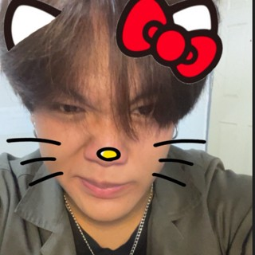
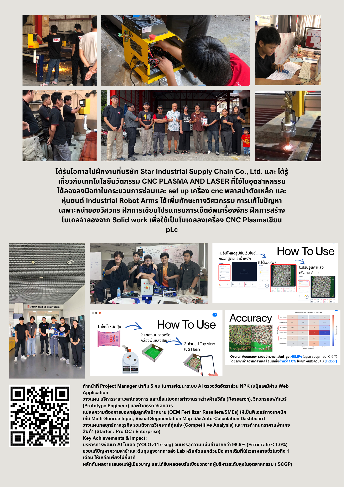
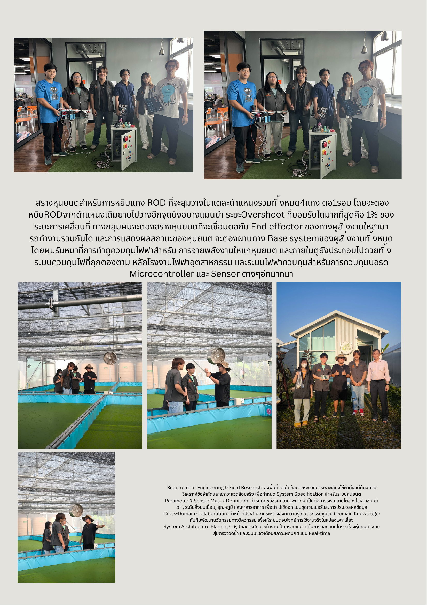

  
### <a href="README.md">Home</a> &nbsp; | &nbsp; <a href="portfolio-bhirabhat.md">Pae's Port</a> &nbsp; | &nbsp; <a href="portfolio-songpol.md">Leng's Port</a> &nbsp; | &nbsp; <a href="portfolio-theeranon.md">Pond's Port</a> &nbsp; | &nbsp; <a href="portfolio-warakorn.md">Big's Port</a> &nbsp; | &nbsp; <a href="portfolio-warawich.md">Nook's Port</a>

 

<h1 align="center">Warawich Silayong</h1>
<h3 align="center">Subject Matter Expert & Project Manager</h3>

FIBO, KMUTT

  
  

---

### About

Robotics & Automation Engineering student at **KMUTT's Institute of Field Robotics (FIBO)**. Brings hands-on industrial manufacturing experience (CNC plasma/laser, PLC), project management for a 5-person AI development team, and field research skills bridging engineering with real-world domain constraints.

| | |
|---|---|
| **Degree** | B.Eng. Robotics & Automation Engineering · FIBO, KMUTT |
| **Hackathon** | JUMP Thailand 2026 Participant |
| **Focus** | Project Management, Industrial Manufacturing, Requirement Engineering |

---

### Highlight Projects & Technical Experience

**AI Product Management**
> **NPK Fertilizer Analysis System:** Project Manager leading a 5-person team building an AI system that measures NPK ratios in chemical fertilizer via a web app. Planned project timelines and bridged research, software engineering, and business/documentation teams. Translated OEM fertilizer reseller/SME needs into technical features (multi-source input, visual segmentation map, auto-calculation dashboard) and business strategy (competitive analysis, tiered pricing: Starter / Pro QC / Enterprise). The underlying **YOLOv11x-seg** model reached **>98.5% accuracy** (error rate <1.0%), cutting analysis time from hours—or up to a month via outsourced lab testing—down to minutes. Presented to industry executives (SCGP) to positive reception.

**Industrial Manufacturing Internship**
> **Star Industrial Supply Chain Co., Ltd.:** Hands-on internship in CNC plasma and laser cutting technology. Repaired and set up CNC plasma metal-cutting machines and industrial robot arms, practiced PLC programming for machine setup, and built SolidWorks reference models used as cutting templates for the CNC plasma system.

**Electrical & Controls**
> **1-DOF Pick-and-Place Robot (ROD picker):** Shared team project — a robot that picks a ROD part from one of 4 randomized positions with ≤1% overshoot tolerance. Responsible for the electrical control box: power distribution to the robot, industrial-standard control circuitry, and the wiring for the microcontroller and sensors.

**Field Research & Systems Planning**
> **Aquaculture Water Quality Monitoring:** Conducted on-site field research into the full shrimp/fish farming cycle, analyzing real-world constraints to define system specifications. Defined the sensor parameter matrix (pH, sediment level, temperature, nutrient levels), coordinated between the aquaculture community's domain knowledge and the engineering team, and planned the system architecture for automated water sampling and real-time abnormality alerts.

---

### Core Skills

**Project & Business**
`Project Management` `Requirement Engineering` `Competitive Analysis` `Cross-Domain Collaboration`

**Industrial Manufacturing**

`CNC Plasma/Laser` `PLC Programming`

**Electrical & Systems**
`Industrial Electrical Control` `Microcontroller & Sensor Wiring` `System Architecture Planning`

---

